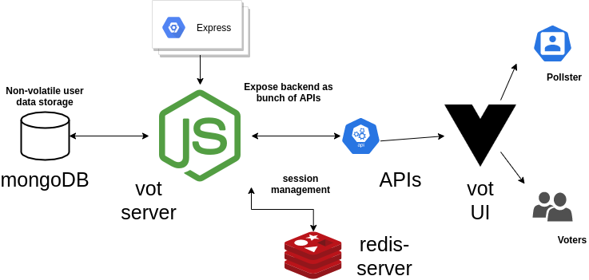

# vot

A simple opinion poll or survey web app using MEVN stack.



## Project setup
```bash
$ git clone https://github.com/vi88i/vot.git && cd vot
$ npm install
# Install mongoDB and redis, before executing the following commands
$ sudo systemctl start mongod 
$ sudo systemctl daemon-reload
$ redis-server
$ npm run serve # start vue app
$ cd vot-server && node users.js # start node.js server
```

## Sign-up and start creating polls. 

## Generate link for the poll and share it with voters

## Pollster can results in real-time
